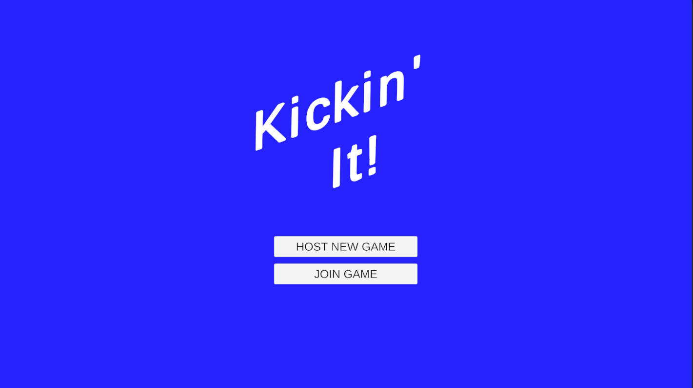
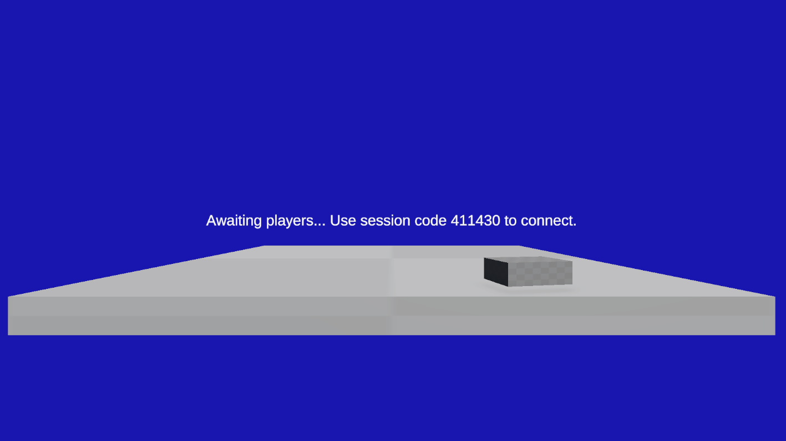

# Kickin' It! - Online Pong Demo Game (WIP)

This repository is a demonstration of a scalable multiplayer game architecture using Unity & Photon Fusion 2.

**Please note:** The demo is still a work-in-progress and is not fully functional.

## Overview

This project is a multiplayer game built on a scalable architecture that reimagines the classic pong game (but is 
actually a Crash Bash clone).
In this game:
- One user creates a session.
- Another user connects to the session using a unique session code.
- Player compete in a pong game to determine the winner.

## Tech Stack

The project leverages the following technologies:
- **URP (Universal Render Pipeline)**
- **Photon Fusion 2**
- **VContainer**
- **R3 for Unity** (previously UniRx)
- **UniTask**
- **Stateless**
- **Odin Inspector**

## Getting Started

### Starting Point

For an overview of the game setup and architecture, please refer to the following source files:

| Level       | Source File                                  |
|-------------|----------------------------------------------|
| Application | `Presentation/App/AppScope.cs`               |
| Meta-Game   | `Presentation/Metagame/MetaGameScope.cs`     |
| Game        | `Presentation/Game/GamePresentationScope.cs` |
| Simulation  | `Simulation/Game/GameSimulationScope.cs`     |
_You can find the source files in the `Assets/Sources` folder._

### Prerequisites

- **Unity:** Ensure you have the appropriate version of Unity installed.
- **Odin Inspector:** To compile and run the project locally, you must import your own copy of the Odin Inspector asset package (this is a paid asset).

## Gameplay

The core gameplay is a modern take on the classic pong game:
- **Session Creation:** One player initiates a game session.
- **Session Join:** A second player can join the session by entering the session code provided.
- **Player Movement:** Each player controls its own cart to deflect the ball back to the opponent.
- **Player Health:** When player misses the ball, he loses a health point.
- **Win/Lose Condition:** When player score reaches 0, he loses the game.

## Controls

Players can control their paddle using the following keys:
- **A Key:** Move paddle to the left.
- **D Key:** Move paddle to the right.

## Future Work

Since the demo is a work-in-progress, expect further developments including:
- Finalizing the core game mechanics.
- Enhanced gameplay features.
- More robust network handling.
- Additional documentation and improvements in user experience.

Contributions and feedback are welcome as I continue to refine and expand this project.